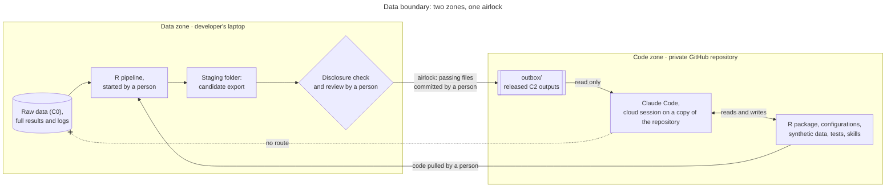

# nansenbiomass — Specification v1.0

Sep 27, 2026 · @NN

## 0. Document status

This is version 1.0 of the specification for nansenbiomass, the biomass reconstruction tool. It fixes the architecture, the data-protection model and the decisions recorded in Section 15.

- Decisions are tagged **\[D-nn\]** where they arise and listed in the register (Section 15).
- Once reviewed, this document is committed to the repository as `docs/spec.md`. Claude Code reads it in plan mode to produce the implementation plan.
- Changes to Sections 2 and 3 (principles and safeguards) require explicit approval by the project lead, since the rest of the design depends on them.

## 1. Purpose and scope

The tool reconstructs survey biomass and abundance estimates reproducibly with two frameworks: StoX (design-based) and sdmTMB (model-based). Version 1 covers demersal bottom-trawl surveys; pelagic acoustic-trawl surveys are a later extension (Section 12).

**Reconstruction** has two meanings, in this order of priority:

1. Recomputing estimates for individual surveys from archived data, with full provenance, so that official figures can be reproduced and audited.
2. Building consistent time series across surveys and vessel periods. This is considerably more demanding and depends on how catchability is treated \[D-05\].

**Intended users.** Programme scientists and partner-country analysts who run and interpret estimates. The tool must work without Claude Code; AI assistance is an optional layer on top of it.

**Primary products.**

- Harmonised estimate tables and plots for both frameworks (Section 9).
- A comparison report documenting agreement, divergence and diagnostics (Section 8).

## 2. Design principles

Five principles govern every design choice; where they conflict with convenience, the principles prevail.

1. **The AI configures, the code computes, a person releases.** The AI layer writes code, configuration and narrative. Deterministic R code produces every number. A person decides which outputs leave the protected data zone.
2. **Raw data never leave this machine.** No raw or station-level data enter the AI's context at any point (Section 3).
3. **Reproducibility by construction.** Every estimate traces back to a versioned configuration file, a code version, a package snapshot (renv) and a fixed random seed.
4. **The design-based estimate is the reference.** StoX reruns must reproduce official figures before any model-based comparison is interpreted.
5. **Forward compatibility without over-engineering.** Interfaces stay generic enough for pelagic data (Section 12), but version 1 implements only what demersal estimation needs.

## 3. Data-protection safeguards

Raw survey data never enter the AI's context, because anything Claude Code reads, or receives as command output, is sent to the model provider. The safeguards therefore control what the AI can see, not only what it can do, and they do not rely on the provider's data-handling terms.

### 3.1 Data classification

| Class | Examples | AI may see |
| --- | --- | --- |
| C0 Raw | biotic.xml, NAN-SIS exports, catch and length records, echosounder files | No |
| C1 Station-level derived | Densities per haul, station-level fitted values and residuals, model objects (`.rds`), any map or plot showing station positions | No; treated as raw |
| C2 Aggregated | Estimates by survey, stratum and species; CVs and intervals; summary diagnostics (convergence flags, test statistics, AIC) | Yes, after the disclosure check |
| C3 Structural | Code, configuration files, data schemas (field names and types), synthetic data | Yes |

sdmTMB model objects embed the fitted data, so they are C1. Station positions are C1 even inside aggregated plots, in line with partner-country preferences on coordinate visibility. Edge cases such as stratum polygons are settled in D-02. Official StoX project files (`project.json`, `project.xml`) and stratum files are C3 (decision of 4 October 2026): they hold settings, strata and possibly a station exclusion list and file paths, and may be shared with the AI; survey data and station-level outputs remain excluded.

### 3.2 Zones



The AI works only in the code zone; the only data-derived material it sees is what a person has released into the outbox.

- **Data zone.** Raw data, full results and logs, on the developer's laptop only. Claude Code runs on a separate machine and has no route to it.
- **Code zone.** The private GitHub repository: R package, configurations, synthetic data, tests and skills. Claude Code works on a copy of it in a cloud session.
- **Outbox.** Disclosure-checked C2 outputs released by a person and committed to the private repository. Claude Code reads here but cannot write.

### 3.3 Enforcement layers

Five layers apply together, each covering a gap left by the one before. They sit on a provider-side baseline adopted from BAIT (layer 0): model training switched off for the account in use and feedback transcript uploads disabled. The account is a consumer account: Anthropic retains session data for 30 days, and zero data retention is not available. The design does not depend on layer 0 but keeps it as defence in depth.

1. **Physical separation.** Raw data and full results live only on the developer's laptop, outside the repository and outside any synchronised folder (OneDrive, Google Drive, Dropbox).
2. **Permission rules.** The repository's project settings deny edits to `outbox/`, so the AI cannot create files that look released. On the laptop, user-level settings deny Claude's file tools any access to the data zone, and an uncommitted local project setting disables shell and PowerShell commands. A local session opened by mistake can read code but cannot run anything or open data.
3. **Execution on a separate machine.** Claude Code works only in cloud sessions, on a virtual machine that receives a copy of the repository and nothing else. The machine has no route to the laptop, so code Claude writes and runs cannot reach raw data. This replaces the operating-system sandbox, which is not available on native Windows \[D-04\].
4. **Execution separation.** The developer runs real-data pipelines in R on the laptop, outside Claude Code. Claude Code runs code only against synthetic data. Remote Control, which links a Claude interface to a session on the laptop, is not used for this project.
5. **Output airlock.** The pipeline writes full results to the data zone and a candidate export to a staging folder there. A disclosure-check function validates the export against a field whitelist (no coordinates, station or haul identifiers, or record-level rows) and minimum-aggregation rules \[D-03\]. A person reviews the check report and commits passing files to `outbox/` in the private repository.

The airlock follows the output-checking logic of trusted research environments (the "safe outputs" dimension of the Five Safes model). Section 3.5 sets out how these layers relate to BAIT \[D-01\].

### 3.4 Residual risks

- **Released outputs on GitHub.** Cloud sessions can read only the repository, so released C2 outputs are stored in a private GitHub repository. The data agreements must allow this \[D-04\].
- **Local sessions.** A local Claude Code session in the repository is covered by layer 2; the M0 safeguard test confirms it can neither open the data zone nor run commands.
- **Synchronised folders.** A data zone inside a synced folder would copy raw data off the machine, so it stays outside them.
- **Error messages.** R errors can echo data values. Pipeline wrappers write details to the local log and print only a sanitised code and message, so errors can be shared with Claude safely.
- **Human error.** A person can paste data into a prompt or release the wrong file. Mitigated by the disclosure check, a release checklist and a short briefing for all users.

### 3.5 Relation to BAIT

This design adopts BAIT's safeguards and adds technical enforcement on top, because this project handles partner-country data under separate agreements.

BAIT, IMR's Biotic AI Toolkit, keeps the database outside the repository, carries privacy rules in the agent's instructions, and has users switch off model training and data retention once. Its agents query the local database and read the results, including record-level rows where a question needs them.

| Safeguard | BAIT | This specification |
| --- | --- | --- |
| Data outside the repository | Yes | Yes (layer 1) |
| Data files kept out of Git and automatic reads | `.gitignore` and `.claudeignore` | `.gitignore` plus permission deny rules (layer 2) |
| Privacy rules in the agent's instructions | `CLAUDE.md` guardrails | Adopted in this project's `CLAUDE.md` |
| Model training and data retention off | One-time onboarding check, recorded locally | Adopted as layer 0 and verified at M0 |
| Agent queries real data | Yes; results enter the context | No; a person starts real-data runs (layer 4) |
| Real-data material reaching the model | Query results, kept small | Released C2 aggregates only (layer 5) |
| How rules are enforced | Instructions and reminders | Permission rules and execution on a separate cloud machine (layers 2 and 3) |
| Sensitive positions | Ask before producing position-level outputs | Positions are C1 and never released |
| Response to a leak | Stop, inform, revoke access, report | Adopted |

The main difference is deliberate. Under BAIT, query results travel to the model provider, although they are not retained or used for training when the settings are correct. That falls short of the requirement that no raw data leave this machine.

Claude Code's documentation describes permission rules as its enforcement mechanism for file access. The specification therefore implements the intent of BAIT's `.claudeignore` as deny rules, which Claude Code enforces itself.

## 4. Architecture

The tool is one R package (`nansenbiomass` \[D-15\]) with a configuration layer and a skills layer, delivered as a module of the Nansen toolchain. It reads biotic.xml files directly or a DuckDB database on the user's machine or a server \[D-06\], reusing BAIT's data layer where Nansen data can be loaded into it \[D-17\].

| Module | Responsibility | Touches | Claude may run it on |
| --- | --- | --- | --- |
| `data_io` | Read biotic.xml files or a DuckDB database into the internal structure; validate against the schema | C0 | Synthetic data only |
| `disclosure` | Check candidate exports and stage them for release | C1 to C2 | Synthetic data only |
| `stox_sweptarea` | Generate StoX projects from template and configuration; run them headless via RstoxFramework | C0 | Synthetic data only |
| `sdm_index` | Build grid and mesh, fit sdmTMB, run diagnostics, compute the index | C0 | Synthetic data only |
| `compare` | Harmonise outputs and compute agreement metrics | C1 | Synthetic data only |
| `report` | Render the comparison report | C2 only | Released outputs |
| `synth` | Generate synthetic surveys from known spatial fields | C3 only | Anything |

**Proposed repository layout.**

```
R/             package functions
inst/stox/     StoX project templates
configs/       one YAML file per survey and run
synthetic/     generated test surveys
tests/         testthat suites
outbox/        released C2 outputs, committed after release (read-only for Claude)
cloud/         setup script for the cloud environment
.claude/       settings and skills
docs/spec.md   this document
docs/method/   method notes adapted from index-template, with its MIT licence
CLAUDE.md      conventions and rules for Claude Code
```

Raw data and full results sit outside the repository, under a root path set by an environment variable (for example `NANSEN_DATA_ROOT`), and are never committed. Each real-data run has one entry point, for example `nansenbiomass::run_estimate("configs/<survey>.yml")`, started by a person in R on the laptop, outside Claude Code.

## 5. Data inputs

Version 1 needs five inputs per survey plus a synthetic twin; only the biotic data and any station-level files are restricted to the data zone.

| Input | Format | Source | Class |
| --- | --- | --- | --- |
| Biotic data (stations, catches, length samples) | NMDBiotic XML (biotic.xml) or DuckDB | biotic.xml files, or a DuckDB database on the user's machine or a server \[D-06\]; legacy NAN-SIS data not supported \[D-07\] | C0 |
| Gear and swept-width parameters | Survey configuration (YAML) | Survey reports and cruise records | C3 |
| Stratum polygons | Polygon file readable by StoX | Survey design documents | C3 or C1 \[D-02\] |
| Bathymetry | Raster (GeoTIFF) | GEBCO grid | C3 |
| Official estimates for validation | Table (CSV) | Published survey reports | C2 |
| Synthetic surveys | Same schema as the biotic data | `synth` module | C3 |

No pilot surveys are provided to the project \[D-08\]. Development and automated tests use synthetic surveys; the developer compares results with official estimates manually.

## 6. Design-based estimation (StoX swept-area)

StoX projects are generated from a versioned template and a survey configuration file, then run headless through RstoxFramework; no project is edited by hand.

**Configuration fixed per survey.**

- Stratum system and survey definition.
- Station inclusion rules: valid tows, tow-duration limits, gear-performance flags \[D-09\].
- Swept width: a fixed value or tow-specific door or wing spread \[D-09\].
- Species and categories: total biomass, plus length-based abundance where length samples allow.
- Bootstrap: number of replicates and random seed \[D-10\].

**Outputs.** Point estimates by stratum and in total, with bootstrap CVs and percentile intervals. Full outputs stay in the data zone; the aggregated summary is staged for release. Every output records the StoX and Rstox package versions used.

**Acceptance.** Automated tests verify the pipeline on synthetic surveys. The developer confirms manually that reruns reproduce official estimates within the agreed tolerance \[D-11\].

## 7. Model-based estimation (sdmTMB)

The sdmTMB module fits a spatial model to haul catches and integrates predictions over exactly the same domain as the StoX strata, so that differences reflect the estimator rather than the area.

IMR's index-template pack, which builds sdmTMB bottom-trawl indices following [Vihtakari et al. (2026)](https://doi.org/10.1093/icesjms/fsag009) with helpers from sdmTMBexperiments, is adapted for this module rather than forked \[D-16\].

- **Response and effort.** Catch (kg) per haul, with log swept area (km²) as an offset.
- **Error families.** Tweedie and delta-gamma are both fitted and compared; neither is assumed in advance \[D-12\].
- **Spatial structure.** A spatial random field on a mesh built in a projected coordinate system with km units. Mesh cutoff set by the built-in sensitivity routine \[D-13\]; anisotropy tested.
- **Covariates.** Depth (as a smooth term) taken from bathymetry at haul positions. Further covariates only with a stated hypothesis.
- **Prediction grid.** Regular grid clipped to the union of the StoX strata, with depth from bathymetry and cell area used in integration; resolution \[D-13\].
- **Index.** Area-weighted biomass with bias correction (`get_index(..., bias_correct = TRUE)`), reported by stratum and in total.
- **Diagnostics, required before an index is reported.** `sanity()` checks, simulation-based residuals, k-fold cross-validation (`sdmTMB_cv()`), and sensitivity to family, mesh and grid.
- **Multi-year models.** Spatiotemporal fields and vessel or period effects belong to milestone M5 only, and only where identifiable \[D-05\].

Model objects and station-level residuals are C1 and never leave the data zone; only their summary statistics can be released.

## 8. Validation and comparison

Validation runs in four tiers, and a later tier is interpreted only when the earlier ones pass.

1. **Reproduction.** The developer confirms manually that StoX reruns reproduce official estimates within tolerance \[D-11\]. A failure blocks all further work on that survey.
2. **Simulation self-test.** On synthetic surveys generated from known spatial fields, both frameworks recover the true biomass within their stated uncertainty. This tier also tests the code the AI writes.
3. **Model adequacy.** Every real-data sdmTMB fit passes the diagnostics in Section 7.
4. **Cross-framework comparison.** The ratio of sdmTMB to StoX estimates, with intervals, by survey, stratum and species.

**Interpreting divergence.** Divergence is information to diagnose, not evidence of error in either framework. Divergence beyond the agreed threshold \[D-14\] triggers a documented check of coverage gaps and extrapolation, extreme hauls, stratum boundary effects, mesh and grid resolution, and family choice.

**Uncertainty.** StoX bootstrap CVs reflect sampling-design variance; sdmTMB standard errors are conditional on the model. Reports show both, labelled as such, and never pool them.

## 9. Outputs and reporting

All methods write one long-format table with the same fields, and this is the only estimate format permitted to reach the outbox.

| Field | Type | Content |
| --- | --- | --- |
| `survey_id` | text | Programme survey identifier |
| `year` | integer | Survey year |
| `species_code` | text | Taxon code from the Programme taxonomy reference |
| `stratum` | text | Stratum name, or `total` |
| `method` | text | `stox_sweptarea` or `sdmtmb` (later `stox_acoustic`) |
| `quantity` | text | `biomass` or `abundance` |
| `value` | number | Estimate |
| `unit` | text | For example `tonnes` or `millions` |
| `cv` | number | Coefficient of variation |
| `ci_lower`, `ci_upper` | number | Interval bounds |
| `ci_type` | text | For example `bootstrap_percentile_95` or `model_se_95` |
| `config_hash` | text | Hash of the configuration file used |
| `code_version` | text | Package version and Git commit |
| `run_time` | datetime | UTC timestamp of the run |
| `disclosure` | text | Outcome of the disclosure check |

The comparison report is rendered from released C2 outputs only. It can therefore be drafted and revised with AI assistance without any change to the data boundary.

## 10. Claude Code skills

Skills encode the operating workflow so that routine tasks are repeatable; none of them can read the data zone or run the pipeline on real data.

| Skill | Purpose | Reads | Writes | Runs |
| --- | --- | --- | --- | --- |
| `new-survey-config` | Draft a survey configuration from metadata and the published survey report | Schema, templates, public report details | `configs/` | Configuration validation (no data) |
| `synthetic-check` | Build a synthetic twin of a survey design and run both frameworks on it | `configs/`, `synthetic/` | `synthetic/`, test results | Pipeline on synthetic data |
| `interpret-diagnostics` | Summarise released diagnostics and flag concerns against Section 8 | `outbox/` | Notes in `docs/runs/` | Nothing |
| `compare-estimates` | Draft the comparison narrative from released outputs | `outbox/` | Report drafts | Report rendering (C2 only) |
| `release-checklist` | Walk a person through the airlock steps before release | The disclosure-check report (pass or fail, field names, row counts) | Checklist record | Nothing |

Each skill's instructions state its data boundary explicitly. When a skill needs a number that only real data can provide, it asks the person to run the pipeline and release the relevant C2 output.

The workflow skills follow index-template's four steps (compile, fit, validate, report), adapted so that every real-data step is handed to the person \[D-16\].

## 11. Implementation milestones

Milestones run in sequence, each closed by a check that can be verified; the airlock exists before the first real-data output is produced.

| # | Milestone | Deliverable | Acceptance check |
| --- | --- | --- | --- |
| M0 | Safeguards and scaffolding | Repository, `CLAUDE.md`, project and local settings, cloud environment setup script, start-up safeguard test | A local session cannot open the data zone or run commands; a cloud session builds and tests the package on synthetic data |
| M1 | Data layer, synthetic generator, airlock | `data_io`, `synth`, `disclosure` | Real and synthetic data pass the same schema checks; the disclosure check rejects a deliberately disclosive export |
| M2 | StoX swept-area pipeline | `stox_sweptarea` | Synthetic tests pass; developer confirms manual reproduction of official estimates \[D-11\] |
| M3 | sdmTMB single-survey index | `sdm_index` | Simulation self-test and sensitivity routine pass on synthetic surveys \[D-13\] |
| M4 | Comparison and report | `compare`, `report` | Report renders from the outbox alone and covers all four validation tiers |
| M5 | Multi-survey time series (conditional) | Spatiotemporal models | Undertaken only if D-05 is decided in favour; criteria set at that point |
| M6 | Skills layer | Skills in `.claude/skills/` | Each skill runs end to end on synthetic data without touching the data zone |

Claude Code starts each milestone in plan mode against this specification, and no milestone is merged before its acceptance check passes and the code has been reviewed by a person.

**Scope of the M0 check.** M0 delivers a scaffold with empty module files, so its cloud check confirms that the package builds, passes `R CMD check` and runs its smoke test in a cloud session with the packages installed. No estimation code and no synthetic survey exist yet. The first check on synthetic data comes with the `synth` module at M1.

## 12. Forward compatibility: pelagic extension

Pelagic estimation changes the observation process, so it will be a separate module rather than a variant of the demersal one. Acoustic-trawl estimates combine along-track NASC with trawl-based species and length allocation and target-strength relationships.

**Likely approach.** A hybrid in which the StoX acoustic-trawl model allocates NASC to species and sdmTMB integrates the allocated densities spatially. Uncertainty from the allocation step must then be propagated separately.

**Questions to resolve at that stage.**

- Aggregation length of the sampling units, and the handling of along-track autocorrelation.
- Zero-inflation and patchiness in acoustic densities.
- How allocation uncertainty enters the reported intervals.
- The evidence base for model-based acoustic indices is thinner than for trawl indices, so the module starts as exploratory.

**Obligations on version 1.**

- `sdm_index` accepts generic density observations (location, sampling-unit area or effort, response) rather than swept-area-specific inputs.
- The output schema already admits `stox_acoustic` as a method.
- Echosounder exports (for example from LSSS) are classified C0 from the outset.

## 13. Out of scope for version 1

The following are deliberately excluded, to keep version 1 small enough to validate properly.

- Runtime calls to an AI model through the Claude API; the tool itself contains no model calls.
- Pelagic acoustic-trawl estimation (Section 12).
- Legacy NAN-SIS data; only biotic.xml files and DuckDB databases are read \[D-07\].
- A Shiny interface; one can be added later using the shared `nansenui` package.
- Multi-survey models, unless D-05 is decided in favour.
- Automated release of outputs without human review.
- Stock assessment or management advice; the tool produces survey estimates and indices only.

## 14. Requirements, roles and governance

The technical requirements are modest; the governance steps are what make the AI-assisted layer defensible to partners.

**Software.**

- R, with package versions pinned through renv.
- StoX R packages (RstoxFramework, RstoxBase, RstoxData) at versions matched to the StoX release in use.
- sdmTMB, sdmTMBexperiments, sf, terra and testthat.
- Claude Code in cloud sessions started from Claude Desktop (Pro or Max plan), in a cloud environment whose setup script installs R and the packages from precompiled Linux binaries. On the laptop, R for Windows with the same package versions.

**Roles.**

- Project lead: owns the decisions in Section 15 and releases outputs through the airlock.
- Methodological reviewer \[to be named\]: reviews the sdmTMB components and validation results.
- Data steward \[to be named\]: confirms permissions for each survey processed, and the data classification.
- Claude Code: implements under review; has no authority to release outputs.

**Governance.**

- Confirm that AI-assisted development on code, configuration and C2 aggregates is compatible with the data agreements covering the surveys processed, including storage of released C2 outputs in a private GitHub repository.
- Confirm applicable IMR and FAO rules on the use of AI tools.
- Keep this section and Section 3 in a form that can be shared with partner countries on request.
- All AI-written code is reviewed by a person before merge.

## 15. Decisions register

All seventeen decisions are settled.

| ID | Decision | Agreed direction | Status |
| --- | --- | --- | --- |
| D-01 | Alignment with BAIT (IMR Biotic AI Toolkit) | Adopt BAIT's provider-side and instruction-level safeguards on top of technical enforcement; keep real-data execution outside the AI's reach (Section 3.5) | Decided |
| D-02 | Classification of edge cases: stratum polygons, species lists, station counts per stratum | Polygons C3 where published in survey reports; station counts C2 only above the minimum set in D-03. Extended 4 October 2026: stratum files and official StoX project files (settings, strata, any station exclusion list, file paths) are C3 and may be shared with the AI; biotic data and station-level outputs stay excluded | Decided |
| D-03 | Disclosure rules: field whitelist and minimum aggregation | Whitelist limited to the Section 9 fields. No released cell based on fewer than 5 stations, or on fewer than 3 stations with a positive catch of the species unless none is positive (the cell then reveals no catch); configurations may raise either minimum, never lower it. Station counts are those inside each stratum, the same for both frameworks. Interpretation adopted 29 September 2026: no release may let a withheld stratum be recovered by subtracting the released strata from the total. The rules restrict what is released, not the stations used in estimation | Decided |
| D-04 | Execution environment for Claude Code | Cloud sessions from Claude Desktop; WSL2 not used. Claude runs only on a cloud machine holding the repository, real data stay on the laptop, local sessions cannot run commands, and released C2 outputs are stored in the private repository | Proposed |
| D-05 | Time-series scope and treatment of catchability across vessels and gear | Defer to M5; decide after M3 results | Decided |
| D-06 | Input interface | biotic.xml directly or duckdb in user's machine or server | Decided |
| D-07 | Route for legacy NAN-SIS data | not to be supported | Decided |
| D-08 | Pilot surveys | One or two well-sampled demersal surveys with official StoX estimates and clear permissions will not be provided. Any comparisons will be made by the developer manually. | Decided |
| D-09 | Station inclusion rules and swept width | Replicate the rules behind the official estimates | Decided |
| D-10 | Bootstrap replicates and seed | Match the official runs; fix and record the seed | Decided |
| D-11 | Reproduction tolerance | Point estimates identical to reporting precision; CVs within bootstrap noise | Decided |
| D-12 | sdmTMB error family | Fit Tweedie and delta-gamma; choose on residuals and cross-validation; report the sensitivity | Decided |
| D-13 | Mesh cutoff and grid resolution | Alternative solution since pilot surveys will not be provided: a built-in sensitivity routine refits each real survey over a small set of mesh cutoffs and grid resolutions, releases the index sensitivity as a C2 diagnostic and applies a pre-agreed selection rule; defaults calibrated on synthetic surveys | Decided |
| D-14 | Divergence threshold between frameworks | Flag when intervals do not overlap or the ratio falls outside a pre-agreed band | Decided |
| D-15 | Package name | `nansenbiomass`, following the toolchain naming convention | Decided |
| D-16 | Reuse of index-template and sdmTMBexperiments in the sdmTMB module | Adapt, not fork: sdmTMBexperiments as a pinned R dependency; method notes copied from a pinned commit, keeping the MIT licence and copyright notice; own skills following the four-step workflow, with real-data steps run by a person; periodic comparison with upstream; courtesy note to the maintainer | Decided |
| D-17 | Use of BAIT's data layer (BioticExplorerServer database) for Nansen biotic data | Confirm whether Nansen biotic.xml files can be loaded; if so, reuse BAIT's data model, field glossary and quality-code knowledge in `data_io` | Decided |

## Sources

- [Claude Code: configure permissions](https://code.claude.com/docs/en/permissions.md)
- [Claude Code: sandboxed Bash tool](https://code.claude.com/docs/en/sandboxing.md)
- [BAIT: Biotic AI Toolkit](https://github.com/DeepWaterIMR/BAIT)
- [BAIT: CLAUDE.md privacy guardrails](https://github.com/DeepWaterIMR/BAIT/blob/main/CLAUDE.md)
- [BAIT: biotic-privacy skill](https://github.com/DeepWaterIMR/BAIT/blob/main/skills/biotic-privacy/SKILL.md)
- [index-template: sdmTMB survey indices with AI agents](https://github.com/DeepWaterIMR/index-template)
